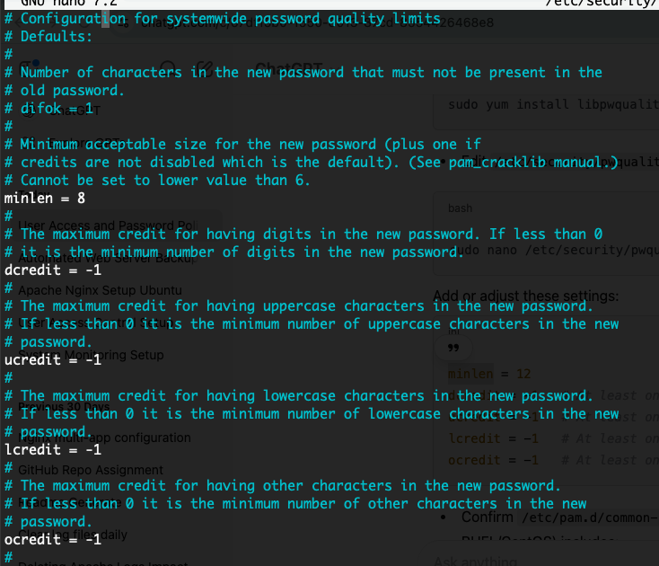
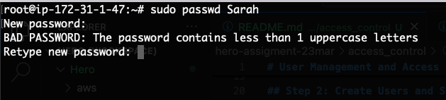
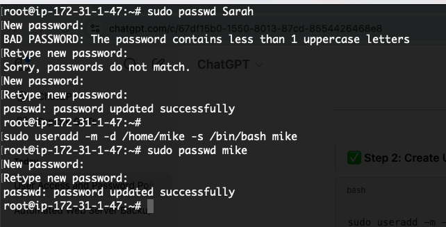
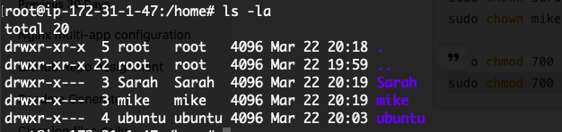
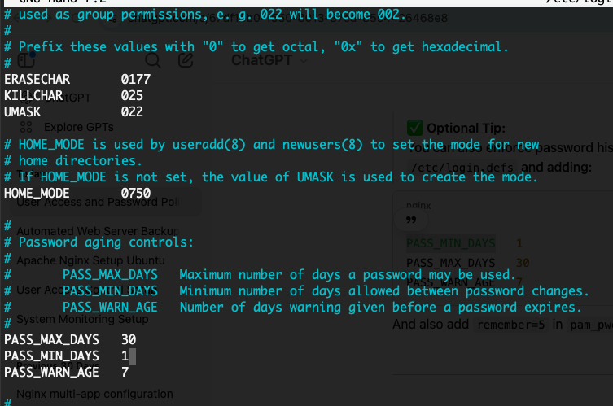

# User Management and Access Control

Set up user accounts and configure secure access controls for the new developers.

## Step 1: Enforce Password Policy (System-wide)

- Install libpam-pwquality 
`sudo apt-get install libpam-pwquality -y`

- Edit Config of `/etc/security/pwquality.conf:`
```
minlen = 12
dcredit = -1   # At least one digit
ucredit = -1   # At least one uppercase letter
lcredit = -1   # At least one lowercase letter
ocredit = -1   # At least one special character`
```

### Output ###

**Set Up Rules for the password**



## Step 2: Create Users and Set Passwords

```
sudo useradd -m -d /home/Sarah -s /bin/bash Sarah
sudo passwd Sarah   # Password complexity policy now enforced

sudo useradd -m -d /home/mike -s /bin/bash mike
sudo passwd mike
```
- Password for Sarah - sAr@h#2025
- Password for Mike - M1ke#2025

### Output ###

**Validation of Password**



**Set Valid Password**




## Step 3: Set password expiration to 30 days

```
sudo chage -M 30 Sarah
sudo chage -M 30 mike
```
## Step 4: Create directories, set ownership and permissions

```
sudo mkdir -p /home/Sarah/workspace
sudo mkdir -p /home/mike/workspace

sudo chown Sarah:Sarah /home/Sarah/workspace
sudo chown mike:mike /home/mike/workspace

sudo chmod 700 /home/Sarah/workspace
sudo chmod 700 /home/mike/workspace
```

### Output ###

**Create of folders with Permission for respective users**




## Step 5: Minimum Days betweek password change:

You can also enforce password history and minimum days between password changes by editing /etc/login.defs and adding:

```
PASS_MIN_DAYS   1
PASS_MAX_DAYS   30
PASS_WARN_AGE   7
```

### Output ###

**Set Up Max and Min Days**




